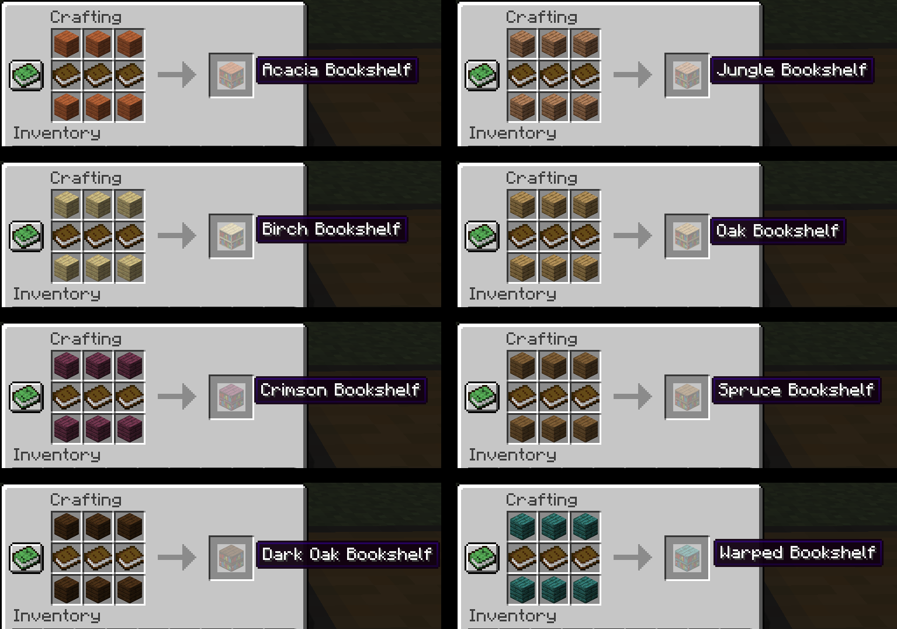
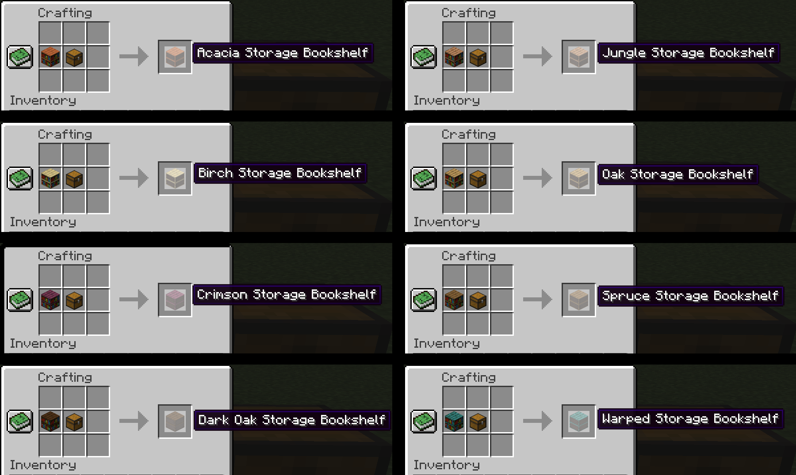

# Minekea (Fabric)

   

_Simple, functional, decorative blocks for all your building and storage needs (some assembly required)_

## Introduction

This mod contains a wide variety of functional and decorative furniture blocks for use in your Minecraft world.

### Versions

* 1.18.x: supported
* 1.17.x: supported
* < 1.17: not planned

### Current Features

* Variant bookshelves in all wood types
* Storage bookshelves in all wood types
* Variant and storage bookshelves work with enchanting table
* Secret doors and trapdoors in all bookshelf types
* Storage crates in all wood types which can store as much as a double chest
* Variant barrels in all wood types

### Planned/Possible Features

* Iron shelves which display their contents (in progress)
* More varieties of bookshelves
* Display cases
* Other types of hidden or disguised storage

### Screenshots

## Issues & Suggestions

Please use the [GitHub issue tracker](https://github.com/chimericdream/minekea-fabric/issues) to report any bugs
you find. If you have a suggestion for a feature that might fit with the mod, or if you think something should be
tweaked or removed to improve gameplay, submit those as well!

## Credits

Obviously this mod would not be possible if not for the people at Mojang making an awesome game. In addition, many
thanks go to the developers of the Fabric mod loader.

I originally got the idea for this mod after using the
[Shelf Storage datapack by Technodono](https://www.planetminecraft.com/data-pack/shelf-storage/). They have my sincere
thanks for creating such an awesome datapack and inspiring this mod!

## License

This mod is released under the MIT license. [The full text of the license can be found here.](./LICENSE)
